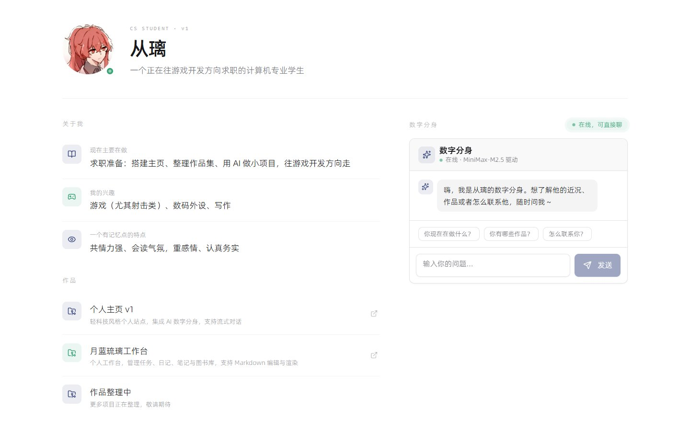

# 个人主页 · 从璃

一个轻科技风格的个人主页，集成了 AI 数字分身，支持流式对话。

> 在线访问：[https://ai-homepage-tau.vercel.app](https://ai-homepage-tau.vercel.app)

## 预览



## 功能特性

- **AI 数字分身**：基于 MiniMax 大模型，以「从璃」的第一人称口吻回答访客问题，支持流式对话与 Markdown 渲染。
- **个人介绍**：展示身份、近况、兴趣与特点。
- **作品展示**：展示个人项目（个人主页、月蓝琉璃工作台等）。
- **联系方式**：邮箱、GitHub 一键直达。
- **响应式布局**：桌面端双栏、移动端自适应。

## 技术栈

React · TypeScript · Vite · Tailwind CSS · shadcn/ui · Supabase（Edge Function 调用 MiniMax）

## 本地开发

```bash
# 安装依赖
npm install

# 启动开发服务器
npx vite --host 127.0.0.1
```
